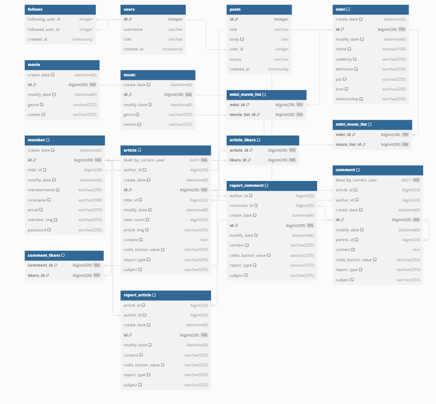

연휴 끝나기 전까지 개인톡으로 제출,왠만하면 오늘까지
### 서비스 설명
#### 회원 관련 기능
- 회원가입
- 로그인/로그아웃
- 소셜 로그인(카카오)
- 회원정보 열람/수정

#### 게시판 관련 기능
- 게시글 작성, 검색, 수정 , 삭제
- 게시글 조회수, 좋아요 기능.
- 댓글 작성, 수정, 삭제
- 대댓글 작성, 수정, 삭제

#### 신고 관련 기능
- 게시글 신고
- 댓글, 대댓글 신고
- 신고 카테고리에 따른 신고 제출

#### 관리자 권한 기능
- 신고글 열람 가능
- 댓글, 게시글 삭제 가능
- MBTI  상세 정보 수정 기능

#### 채팅 관련 기능
- 해당 MBTI 카테고리 입장시
- 카테고리별 실시간 채팅 기능

## 🛠 개발환경
| 분류 | 설명 |
|:--------:|:--------:|
| 운영체제  | Chrome   |
| 통항 개발 환경   | IntelliJ   |
| 프로그래밍 언어   | Java   |
| 버전 관리 시스템   | Git, Github   |
| 데이터베이스   | MySQL   |
| 프레임워크   | Spring   |

 
 

## ☁️ ERD

 
 

## 👀 시연영상

[![Video Label]

## 🔥 트러블 슈팅

@wintersky2
### 🚨 Issue 1
### 🚧 서비스 이슈

A. 이슈 내역
- 서비스에 신고값이 저장 되지 않는 이슈 

문제점 설명
-신고를 구현하는데 서비스를 이용해서 신고에 대한 값을 저장해주려고 했는데 서비스에서
해당 엔터티에 있는 값을 가져오지 못하고 있었다.  
## 🛑 원인
- 서비스에 자꾸 reportComment를 가져오는게 아니라 comment만 가져오고 있었다.

## 🚥 해결
-ReportComment reportComment = ReportComment.builder()가 reportComment를 가져와야 해서 comment엔터티의 값이 아니라 reportComment의 값을 가져와서 정상적으로 저장이 되었다.
 

public void report(Comment comment, String reportContent, Member member, String reportType) {

        ReportComment reportComment = ReportComment.builder()
                .author(member)
                .comment(comment)
                .content(reportContent)
                .reportType(reportType)
                .build();
        this.reportCommentRepository.save(reportComment);
    }
